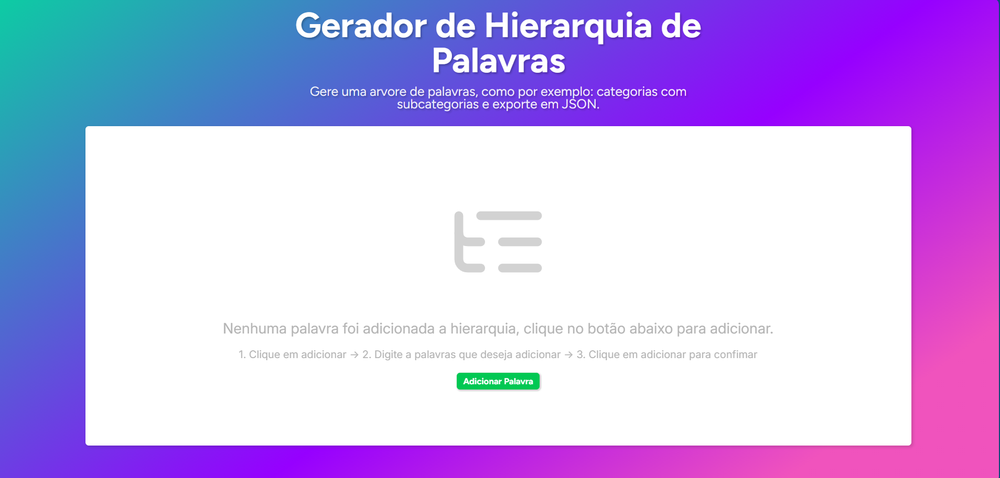
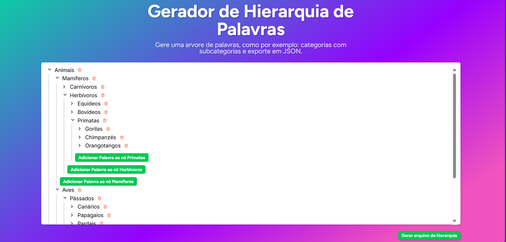

  

# Word Hierarchy

Applicações para gerar arvores de palavras como categorias e subcategorias e analisa frases para determinar correspondentes em uma determinada profundidade.

**Front-end (apps/frontend):** Desenvolvido em React.js, oferece, de forma intuitiva, uma interface para criação e exportação de arvores de palavras.

**Back-end (apps/server):** O sistema desenvolvido em Node.js e utilizando o runtime bun, analisa uma frase fornecida pelo usuário, identifica a profundidade de uma palavra mencionada e exibe os itens próximos dessa profundidade.

## **Funcionalidades**

* Análise de frases com base em uma hierarquia de palavras.  
* Configuração de profundidade para a análise.  
* Opção de visualização de métricas de desempenho.  
* Exibição de resultados em formato de tabela.
* Interface para montagem de arvores de hierarquia.
* Conversão de dados da arvore para arquivo JSON

## **Principais Tecnologias Utilizadas**

* Turborepo: Sistema de build otimizado para monorepos e espaços de trabalho de pacotes únicos.
* TypeScript: Linguagem de programação utilizada para o desenvolvimento.
* Yargs: Biblioteca para construção de interfaces de linha de comando.    
* Node.js: Ambiente de execução para JavaScript.
* Vite: Ferramenta de build rápida para front-end.
* React.js: Biblioteca para contrução de intrefaces de usuário, especialmente SPA.
* Styled-components: Biblioteca de CSS em JavaScript

## **Instalação**

### **Backend**

**1.** Clone o repositório:  `https://github.com/efms25/word-hierarchy.git`

**2.** Entre na pasta: `cd word-hierarchy/apps/server`

**3.** Instale os pacotes: `npm install`

### **Front-end**
> 💡Após a instalação clone do projeto

**1.** Entre na pasta: `cd word-hierarchy/apps/frontend`

**2.** Instale os pacotes: `npm install`

**3.** Instale os pacotes: `npm run dev`

## **Uso Backend**

Para usar a ferramenta, execute o seguinte comando:

`bun cli.js analyze --depth <número> --verbose <true/false> <texto>`

### **Parâmetros**

* \--depth: (opcional) Define a profundidade da análise na hierarquia. O padrão é 1.  
* \--verbose: (opcional) Exibe as métricas de tempo de execução.
* \<texto\>: (obrigatório) O texto que será analisado.

### **Exemplo de Uso**

`bun cli.js analyze --depth 2 --verbose true "Este é um exemplo de texto para análise."`

## **Uso Frontend**

1. Clique em adicionar (na profundidade desejada)
2. Digite a palavras que deseja adicionar 
3. Clique em adicionar para confimar
## **Estrutura do Código**

* apps/server: Backend Node
* apps/frontend: Frontend React

